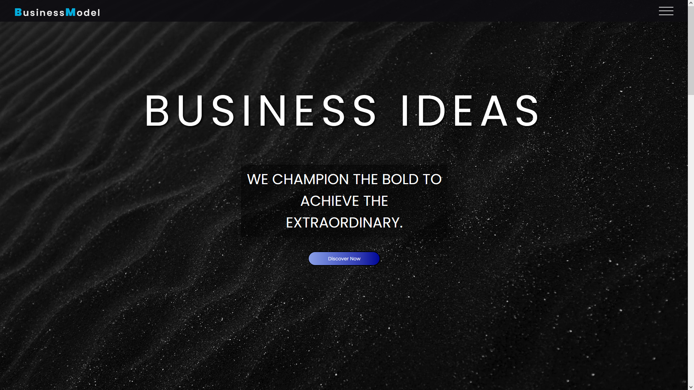
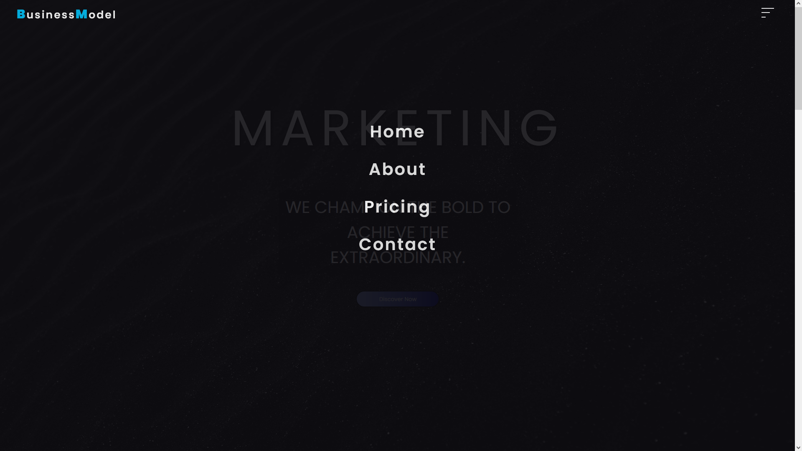
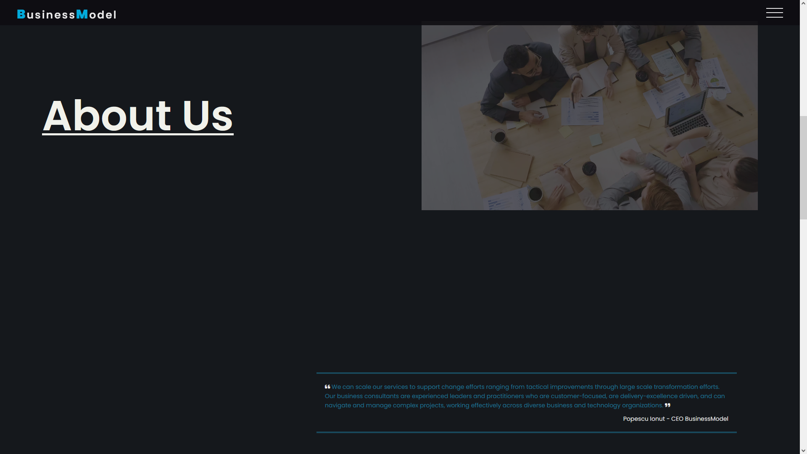
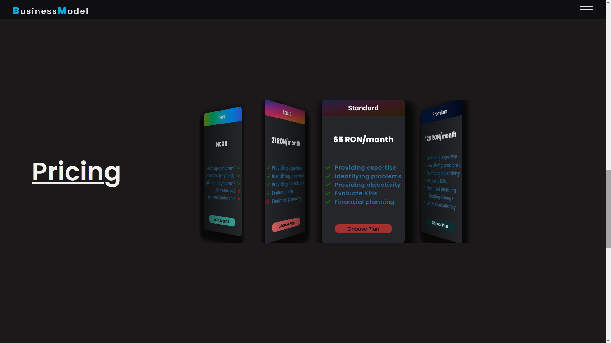
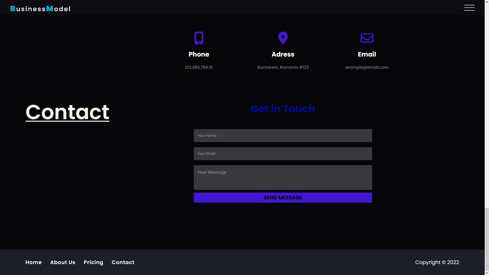
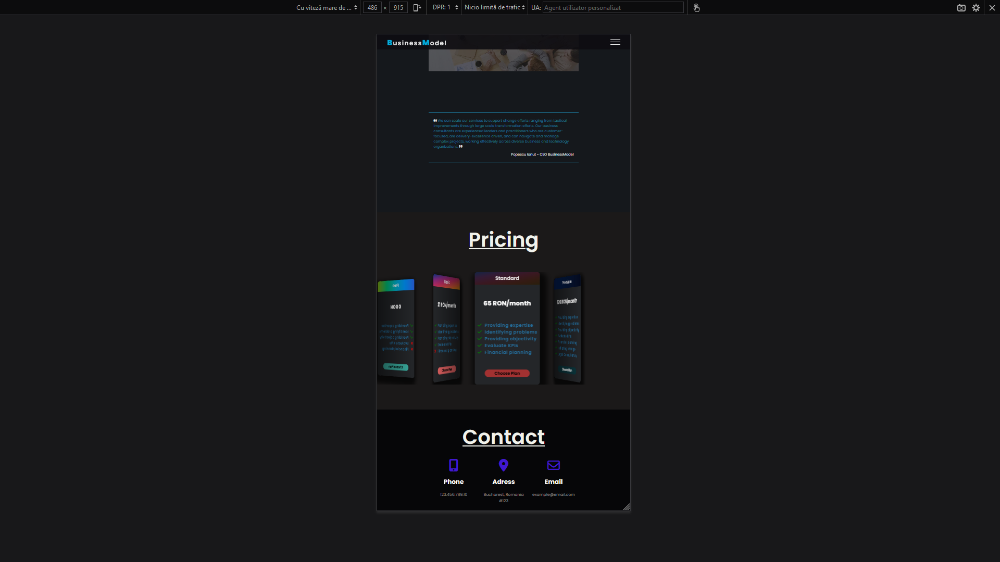

# Business Model Website

This is a project for let's say a business agency website using pure HTML, CSS and JAVASCRIPT and a bit of swiperJS, the website is fully responvive.

## Website Images:

